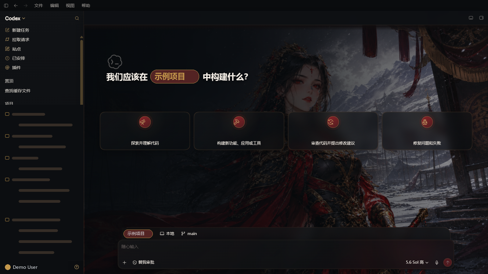
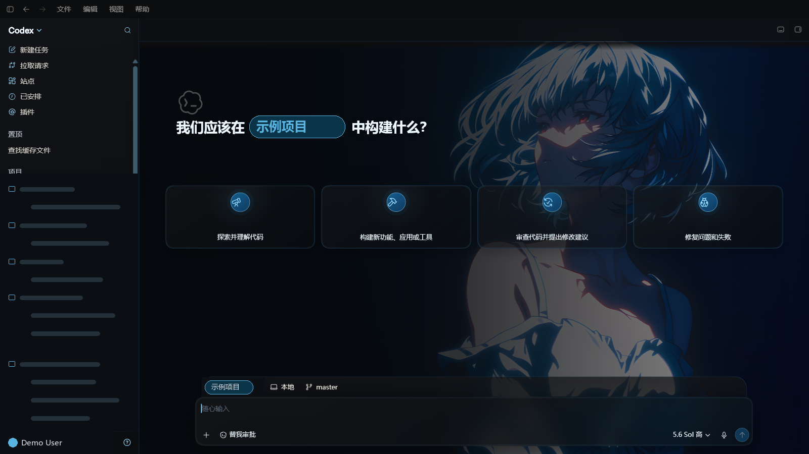

# Codex Dream Skin

  <a href="./README.md">中文</a> · <strong>English</strong>

  <strong>Give Codex a face that breathes.</strong> 
  External themes for the Codex desktop app · Local CDP inject · No official package mutation

  One image, one mood · Code with atmosphere

  Unofficial. Does not modify <code>.app</code> / <code>app.asar</code> / WindowsApps.

## Gallery

One image, one mood. Real theme previews you can ship:

### Finished Windows themes

These two packs were verified in the real Codex window across multiple viewports, live theme switches, and renderer reloads.

   
  Xuanjia Chijin: snowfield scene, layered transparent character, dark red and aged-gold semantics

   
  Blue Night Red Eyes: flattened 4K scene, icy-blue semantics, no extra character layer

The generated shortcuts can switch between both packs without restarting an already-debuggable Codex window. See [`windows/THEME_AUTHORING.md`](./windows/THEME_AUTHORING.md) for the production workflow.

## What it does

- **Real UI** — Sidebar, cards, project picker, and input stay native. Not a fake full-window screenshot.
- **Swappable art** — Drop in an image you like and it becomes your theme.
- **Restorable** — One-click restore to the stock look.
- **Safer path** — Local-loopback CDP inject only. No official binary or signature changes.

## Quick start

Platform scripts are ready — different plumbing, same goal: theme Codex.

| Platform | Dir | Entry |
|------|------|------|
| Apple Silicon / Intel Mac | [`macos/`](./macos/) | Double-click `Install Codex Dream Skin.command` |
| Windows | [`windows/`](./windows/) | `scripts/install-dream-skin.ps1` → `start-dream-skin.ps1` |

More detail:

- Mac: [`macos/README.md`](./macos/README.md)
- Windows: [`windows/SKILL.md`](./windows/SKILL.md)
- Windows theme authoring: [`windows/THEME_AUTHORING.md`](./windows/THEME_AUTHORING.md)
- Paths: [`docs/platforms.md`](./docs/platforms.md)
- Project notes: [`docs/PROJECT.md`](./docs/PROJECT.md)

## Safety

- CDP binds `127.0.0.1` only — avoid untrusted local processes while the theme runs.
- Does not touch the official install directory or code signature.
- **Never** rewrites API Key / Base URL; relay and theme stay separate.

## License

- See [`macos/LICENSE`](./macos/LICENSE) (MIT) and [`macos/NOTICE.md`](./macos/NOTICE.md)
- Unofficial; Codex and related rights belong to their owners.
- People / IP art in previews is illustrative only — clear rights before commercial redistribution.

---

Star it, pick a look, and make Codex yours for today.
